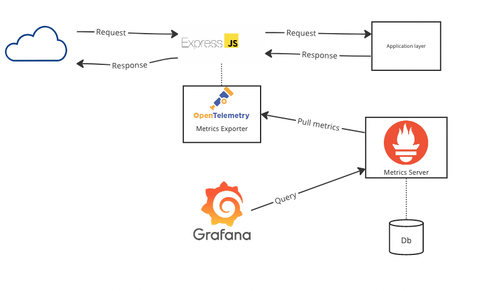

# Prova de Conceito com OpenTelemetry e Prometheus

Este repositório contém uma prova de conceito que demonstra como usar o OpenTelemetry em uma aplicação TypeScript para realizar a telemetria de dados e exportá-los para um servidor do Prometheus.


A prova de conceito consiste em uma aplicação TypeScript simples com um servidor express e um middleware, na qual foram integrados o OpenTelemetry, o Prometheus e o Grafana. O OpenTelemetry é uma estrutura para a instrumentação de código que permite coletar dados de telemetria, como métricas e traces, em diferentes componentes de uma aplicação. O Prometheus está sendo usado processar dados de métricas e o Grafana para que seja possível visualizar essas métricas.


## Modelo proposto

* A aplicação é executada com a instrumentação do OpenTelemetry para coletar algumas métricas por padrão i.e. memória, cpu.
* Está sendo usado um middleware implementando o otel para coletar métricas relevantes da aplicação.
* O OpenTelemetry é configurado para exportar essas métricas através do /metrics.
* Um servidor do Prometheus é configurado para coletar os dados de métricas exportados pelo OpenTelemetry.
* O Grafana pode ser acessado por meio de uma interface gráfica para visualização e consulta das métricas coletadas no servidor do prometheus.



## Executando

1. Clone este repositório

```bash
git clone https://github.com/juniorsdj/otel-typescript
```

2. Execute o docker compose

```bash
docker-compose up -d --build
```


## Adicionando tráfego

Para simular tráfego na aplicação e observar a coleta de métricas em tempo real, você pode usar o script de `yarn test` que está fazendo uso do [`autocannon`](https://www.npmjs.com/package/autocannon)

1. Instale as dependencias

```bash
yarn
```

2. Execute script de teste

```bash
yarn test
```